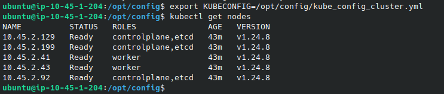
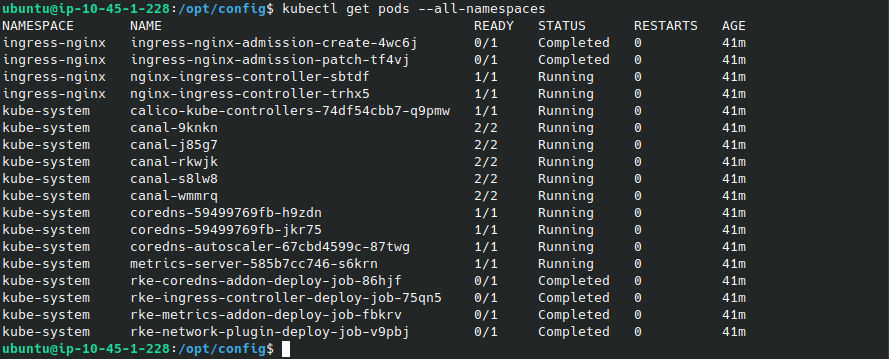
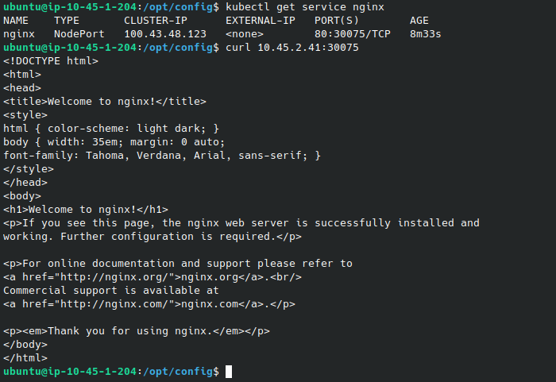

## Configurando um provedor de nuvem AWS para prover um cluster Kubernetes usando Terraform, RKE e Ansible

Este post demonstra como criar e configurar um provedor de nuvem Amazon Web Services (AWS) usando terraform. Os recursos provisionados incluem redes, instâncias e grupos de segurança, fornecendo uma infraestrutura completa.

Além disso, o cluster Kubernetes é implementado usando o Rancher Kubernetes Engine (RKE) por template_file, user_data e um toque de ansible. Com essa abordagem, é possível criar um cluster Kubernetes altamente disponível e escalável.

São utilizados arquivos terraform que incluem módulos personalizados em repositório separado no github. Esses módulos espera receber as definições do CIDR do bloco da VPC e das subnets para criar respectivamente a VPC e dentro dela, as subnets publica e privada. Com isso, é possível personalizar e ajustar a infraestrutura conforme as necessidades de redes projeto.
Em seguida, é definido os grupos de seguranças que restringem o tráfego de entrada e saída por portas e prefixo específicos.

Logo após, é criado os recursos de instâncias EC2 (Amazon Elastic Compute Cloud), instância admin com endereçamento IP elástico associado e responsável por uma pequena automação usando Ansible, além dos masters e workers implementados como grupos escaláveis a partir de contadores, definindo a quantidade de nó respectivamente.

Por fim, os arquivos de template_file são utilizados para gerar os scripts carregados no user_data de cada nó para configurar e resolver as dependências.

Para iniciar o projeto, você precisará seguir as etapas abaixo:

Clone o repositório do projeto no Github em sua máquina local usando o comando:
```
git clone https://github.com/madson7/aws-rke.git
```

Verifique se o Terraform está instalado na sua máquina local. Se não estiver, você precisará instalá-lo seguindo as instruções fornecidas no site oficial do Terraform.

Entre no diretório do projeto usando o comando:
```
cd aws-rke
```

Observe que, para usar o Terraform, você precisará ter credenciais válidas do AWS configuradas em sua máquina local ou usar um provedor de autenticação diferente, como o HashiCorp Vault. Exemplo basíco usando a região us-east-1:

```
cat >> provider.tf <<EOF
provider "aws" {
  access_key = ""
  secret_key = ""
  region     = "us-east-1"
}
EOF
```

Execute o comando para inicializar o Terraform e baixar todas as dependências necessárias:
```
terraform init
```

Use o comando para ver as alterações que serão aplicadas na sua infraestrutura:
```
terraform plan
```

Use o comando para aplicar as alterações na sua infraestrutura:
```
terraform apply
```

Quando a implantação estiver concluída, verifique se a infraestrutura está funcionando corretamente.

O comando export é usado para definir a variável de ambiente KUBECONFIG para apontar para o arquivo de configuração do cluster Kubernetes. Essa variável de ambiente é usada pelo cliente kubectl para se comunicar com o cluster.
```
export KUBECONFIG=/opt/config/kube_config_cluster.yml
```

Verificar se o cluster está em execução usando o comando:
```
kubectl get nodes
```


Verificar se os pods estão em execução usando o comando:
```
kubectl get pods --all-namespaces
```


Para testar um cluster Kubernetes você pode seguir os seguintes passos.

Criar um deployment de exemplo para testar usando o comando:
```
kubectl create deployment nginx --image=nginx
```

Verificar se o deployment foi criado com sucesso usando o comando:
```
kubectl get deployment nginx
```

Criar um serviço para o deployment usando NodePort:
```
kubectl expose deployment nginx --port=80 --type=NodePort
```

Verificar se o serviço foi criado com sucesso e usando o IP de um dos workers você pode acessar na porta mapeada:
```
kubectl get service nginx
```



Links úteis:

https://github.com/madson7/aws-rke.git

https://rancher.com/docs/rke/latest/en/

https://kubernetes.io/docs/home/

https://kubernetes.io/docs/tasks/run-application/run-stateless-application-deployment/

https://github.com/madson7/ansible-roles-templates

https://github.com/madson7/terraform-modules
